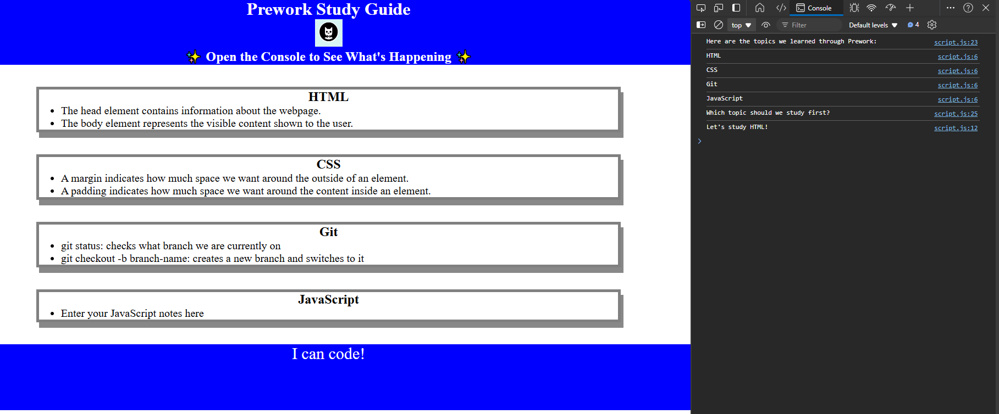

# Coding Bootcamp Pre-work Study Guide Webpage

## Description

This Study Guide was created as a way for coding bootcamp students to collect and present some notes based on the following topics:
 - HTML
 - CSS
 - Git
 - JavaScript

This site is also provides a way to practice the basics of the aforementioned topics.

## Installation

N/A

## Usage

To use this study guide, you can simply review the notes on the landing page under each section.

If you want a suggestion as to what to study first, open the site in the Chrome Browser, click F12 (Windows) or Command+Option+I (macOS) and click on the Console tab. A suggested topic will be listed next to the phrase "Let's study ".

## Credits

N/A

## License

Refer to the license in the repo.
